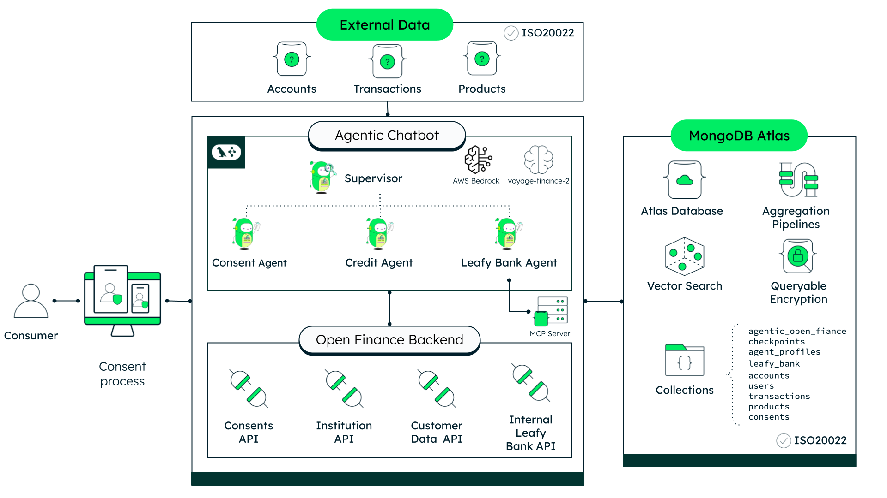

# Leafy Bank Open Finance — Agentic Chatbot

Demonstrates how Agentic AI combined with MongoDB Atlas enables conversational Open Finance consent management, loan portability analysis, and personalized financial advice — all through a multi-agent chatbot powered by LangGraph.

> **This is one of three interconnected repositories that make up the Leafy Bank Open Finance solution:**
>
> | Repository | Description | Port |
> |------------|-------------|------|
> | [open-finance-next-gen](https://github.com/mongodb-industry-solutions/open-finance-next-gen) | FastAPI backend — consents, accounts, transactions, Queryable Encryption | 8003 |
> | **leafy-bank-backend-openfinance-reactagent-chatbot** (this repo) | LangGraph multi-agent chatbot — consent flows, portability analysis, financial advice | 8080 |
> | [open-finance-next-gen-ui](https://github.com/mongodb-industry-solutions/open-finance-next-gen-ui) | Next.js 15 frontend — dashboard, multi-bank views, AI assistant | 3000 |

## Where MongoDB Shines

- **Conversation Persistence**: MongoDB's document model stores full LangGraph checkpoint state — messages, tool call history, interrupt payloads, and active consents — as a single document per conversation turn. Resume any conversation exactly where it left off, across sessions.
- **Atlas Vector Search for Transaction Classification**: The Portability Agent uses Atlas Vector Search to semantically classify spending transactions (e.g., "Uber ride" maps to `TRANSPORTATION`), built into Atlas without a separate vector database.
- **MCP Server for Ad-Hoc Queries**: The Financial Advice Agent connects to MongoDB via the official MCP server, enabling natural language queries against Leafy Bank's internal data — accounts, transactions, products, credit scores — without custom tool code for each collection.
- **Queryable Encryption for Consent Privacy**: The Consent Agent creates and queries consents stored with Queryable Encryption in the Open Finance backend. Sensitive fields (consumer identity, permissions, source institution) are encrypted at rest — the Atlas server never sees plaintext, and equality queries on encrypted fields enable consent lookups without decryption server-side.
- **Queryable Encryption for Agent Profiles**: Agent system prompts and tool configurations are stored in MongoDB with Queryable Encryption — the `agent_name` field supports equality queries on ciphertext, while `system_prompt` and `tool_config` are encrypted at rest. Even with full database access, an attacker cannot read or tamper with the instructions governing agent behavior.
- **Flexible Document Model**: Consent records, external bank data, and underwriting rules all have different shapes. MongoDB stores them naturally without schema conflicts, and the agent reads whatever structure each API returns.

## High-Level Architecture



## Multi-Agent Workflow

<!-- TODO: Add multi-agent workflow diagram -->


```text
User Request → Supervisor (Router)
                    │
          ┌─────────┼──────────────┐
          ▼         ▼              ▼
      Consent    Portability   Financial Advice
       Agent       Agent          Agent
       (9 tools)   (7 tools)     (MongoDB MCP)
          │         │              │
          ▼         ▼              ▼
    Open Finance  Open Finance   MongoDB Atlas
     REST API     REST API       (Leafy Bank DB)
```

A **Supervisor Agent** reads the conversation and routes each request to the right specialist:

- **Consent Agent** — Guides users through secure data-sharing consent with external banks using a 4-pillar framework (Scope, Purpose, Source, Duration). Handles institution selection, consent creation, bank login, explicit user approval, and revocation.
- **Portability Agent** — Analyzes external bank data to produce spending scores, credit assessments, and deterministic loan portability offers. Compares current loan terms against Leafy Bank's rates to show potential savings.
- **Financial Advice Agent** — Answers ad-hoc questions about the user's Leafy Bank accounts, transactions, and products by querying MongoDB directly through the MCP server.

## Human-in-the-Loop

<!-- TODO: Add interrupt/resume flow diagram -->


The chatbot uses LangGraph's `interrupt()` to pause the workflow at two critical points:

1. **Bank Login** — The user needs to authenticate with their external bank. The agent pauses, the frontend shows the bank login UI, and the workflow resumes once login succeeds.
2. **Consent Approval** — Before any consent is finalized, the agent pauses and presents the full consent details (permissions, purpose, bank, duration). The user explicitly approves or declines before the workflow continues.

## Tech Stack

- **[MongoDB Atlas](https://www.mongodb.com/atlas)** for conversation checkpointing and internal bank data
- **[MongoDB Atlas Vector Search](https://www.mongodb.com/docs/atlas/atlas-vector-search/)** for semantic transaction classification
- **[MongoDB MCP Server](https://github.com/mongodb-labs/mongodb-mcp-server)** for natural language queries against internal collections
- **[LangGraph](https://langchain-ai.github.io/langgraph/)** for multi-agent orchestration with supervisor pattern
- **[LangChain](https://python.langchain.com/)** for agent tooling and abstractions
- **[MongoDB Queryable Encryption](https://www.mongodb.com/docs/manual/core/queryable-encryption/)** for encrypted agent profile storage
- **[AWS Bedrock](https://aws.amazon.com/bedrock/)** — Claude Sonnet 4.6 for agents, Claude Haiku 4.5 for supervisor routing and suggestion generation
- **[Voyage AI](https://www.voyageai.com/)** for embedding generation used by Atlas Vector Search
- **[FastAPI](https://fastapi.tiangolo.com/)** (Python) for the REST API backend
- **[Poetry](https://python-poetry.org/)** for Python dependency management

## Prerequisites

Before you begin, ensure you have met the following requirements:

- **Python** 3.11 or higher (but less than 3.14)
- **Poetry** 1.8.4 (install via [Poetry's official docs](https://python-poetry.org/docs/#installation) or `pipx install poetry==1.8.4`)
- **Node.js** 20 or higher (required for MongoDB MCP server via `npx`)
- **MongoDB Atlas** cluster
- **AWS credentials** with Bedrock access (for Claude Sonnet)
- **Voyage AI API key** for embedding generation (get one at [Voyage AI's dashboard](https://dash.voyageai.com/api-keys))
- **Open Finance Backend API** running locally — this is the `open-finance-next-gen` repo, must be running on port 8003
- **Docker & Docker Compose** (optional, for containerized deployment)

## Initial Configuration

### Obtain Your MongoDB Connection String

1. Set up a [MongoDB Atlas](https://www.mongodb.com/atlas) cluster if you don't have one already.
2. Locate your cluster, click **Connect**, and select **Connect your application**.
3. Copy the connection string.

> You'll need this connection string for two environment variables: `MONGODB_URI` (agent checkpointing) and `LEAFY_BANK_MONGODB_URI` (internal data MCP server).

### Set Up AWS Bedrock Access

1. Log in to the [AWS Management Console](https://aws.amazon.com/console/).
2. Navigate to the **Bedrock** service.
3. Request model access for **Anthropic Claude Sonnet** if you haven't already.
4. Ensure your local AWS credentials (`~/.aws/credentials` or environment variables) have the appropriate Bedrock permissions.

> Keep your AWS credentials secure and never commit them to version control.

### Clone the Repository

1. Open your terminal and navigate to the directory where you want to store the project:

   ```bash
   cd /path/to/your/desired/directory
   ```

2. Clone the repository:

   ```bash
   git clone <repository-url>
   ```

3. Navigate into the cloned project:

   ```bash
   cd leafy-bank-backend-openfinance-react-agent-chatbot
   ```

### Start the Open Finance Backend

The chatbot depends on the Open Finance backend API for consent management, institution lookups, and external bank data. Clone and start the `open-finance-next-gen` repo on port 8003 before running the chatbot.

> Without this service running, consent and portability tools will fail with connection errors.

### Set Up Queryable Encryption

Agent profiles are stored with MongoDB Queryable Encryption. The setup requires a master key and an encrypted collection with Data Encryption Keys (DEKs).

1. Generate a 96-byte local master key:

   ```bash
   python -c "import os; open('backend/master-key.bin', 'wb').write(os.urandom(96))"
   ```

2. Run the encrypted agent profiles setup script:

   ```bash
   cd backend && poetry run python ../scripts/setup_encrypted_profiles.py
   ```

   This creates the `openFinanceAgentProfiles` collection, generates DEKs, and saves `encryption_config.json` (gitignored).

3. Agent prompts are seeded from `.md` files on first startup. To force a re-sync from files:

   ```bash
   curl -X POST http://localhost:8080/admin/reload
   ```

> For production, replace the local master key with AWS KMS by setting `KMS_PROVIDER=aws` and `AWS_KMS_KEY_ARN` in your `.env`. Never commit `master-key.bin` or `encryption_config.json` to version control.

### Populate Seed Data

The Leafy Bank financial advice agent requires seed data in your Atlas cluster. Import the following collections into a database called `leafy_bank_test`:

| Collection | Purpose |
| ---------- | ------- |
| `accounts` | User account balances and types |
| `transactions` | Transaction history (DEBIT/CREDIT) |
| `users` | User profiles |
| `products` | Leafy Bank product catalog (loans, credit cards) |
| `credit_bureau_scores` | User credit scores |
| `spending_best_practices` | MCC code ranges and category targets |

> These collections are used by the Financial Advice Agent (MongoDB MCP) and the Portability Agent's spending analysis tools.

## Run it Locally

### Setup

1. (Optional) Set your project description and author information in `backend/pyproject.toml`:

   ```toml
   description = "Your Description"
   authors = [{name = "Your Name", email = "you@example.com"}]
   ```

2. Ensure you are in the root project directory where the `makefile` is located.

3. Run the setup commands:

   ```bash
   make setup
   ```

   This configures Poetry for in-project virtual environments and installs all dependencies. Verify that the `.venv` folder has been generated within the `backend/` directory.

4. Create a `backend/.env` file with your configuration:

   ```bash
   # MongoDB (conversation checkpointing)
   MONGODB_URI=
   DATABASE_NAME=agentic_open_finance

   # AWS Bedrock
   AWS_REGION=us-east-1
   CHAT_COMPLETIONS_MODEL_ID=us.anthropic.claude-sonnet-4-6

   # Checkpointer Collections
   CHECKPOINTS_AIO_COLLECTION=openFinanceCheckpoints
   CHECKPOINTS_WRITES_AIO_COLLECTION=openFinanceCheckpointWrites

   # Open Finance Backend API
   OPEN_FINANCE_API_URL=http://localhost:8003

   # MongoDB MCP Server (Leafy Bank internal data)
   LEAFY_BANK_MONGODB_URI=

   # Vector Embeddings (transaction classification)
   VOYAGE_API_KEY=

   # Queryable Encryption (agent profiles)
   KMS_PROVIDER=local
   LOCAL_MASTER_KEY_PATH=backend/master-key.bin
   ENCRYPTION_CONFIG_PATH=backend/encryption_config.json
   ```

### Running Locally

Start the development server with:

```bash
make dev
```

- **Chat API**: <http://localhost:8080>
- **Swagger Docs**: <http://localhost:8080/docs>
- **Embedded Chat UI**: <http://localhost:8080/chatbot>

You can also run with different verbosity levels:

```bash
make run            # Production mode (no reload)
make run-verbose    # Debug logging
make logs           # Trace logging (most verbose)
```

**Quick health check:**

```bash
make check          # Verify app imports correctly
```

**CLI test harness** (no server required):

```bash
cd backend && poetry run python3 console_chat.py
```

## Run with Docker

Make sure to run this from the root directory.

To run with Docker:

```bash
make build
```

The chatbot will be available at <http://localhost:8080>.

To manage the container:

```bash
make start    # Start existing container
make stop     # Stop container
make clean    # Remove container and images
```

## API Endpoints

| Method | Path | Purpose |
| ------ | ---- | ------- |
| `GET` | `/` | Health check |
| `GET` | `/chatbot` | Embedded React chat UI |
| `POST` | `/chat` | Send message, get response + optional interrupt |
| `POST` | `/chat/resume` | Resume after interrupt (bank login or consent approval) |
| `POST` | `/chat/stream` | Send message, stream agent steps via SSE |
| `POST` | `/chat/stream/resume` | Stream after resume |
| `POST` | `/checkpointer/clear-all-memory` | Clear all conversation threads |
| `GET` | `/api/v1/encryption-demo/compare/{agent_name}` | QE encrypted vs decrypted agent profile comparison |

### Request Format

```json
{
  "user_id": "fridaklo",
  "message": "I want to share my data from Banco do Brasil",
  "thread_id": "optional-thread-id",
  "profile": "Balanced"
}
```

### Response Format

```json
{
  "thread_id": "abc-123",
  "response": "I can help you share your data...",
  "interrupt": null
}
```

When the agent pauses for human input, `response` is empty and `interrupt` contains the payload:

```json
{
  "thread_id": "abc-123",
  "response": "",
  "interrupt": {
    "type": "BANK_LOGIN",
    "consent_id": "consent-456",
    "institution_name": "Banco do Brasil"
  }
}
```

### Streaming (SSE)

The `/chat/stream` and `/chat/stream/resume` endpoints return Server-Sent Events with these event types:

| Event Type | Description |
| ---------- | ----------- |
| `thread_id` | Conversation thread identifier |
| `status` | Agent routing status (which agent is active) |
| `tool_call` | Tool invocation with name and arguments |
| `tool_result` | Tool execution result |
| `progress` | Sub-step progress updates |
| `agent_complete` | Agent finished its turn |
| `response` | Final agent response text |
| `suggestions` | Contextual reply suggestions (e.g., "Accept offer", bank names) |
| `interrupt` | Workflow paused for human input |
| `error` | Error details |
| `done` | Stream complete |

## Agent Tools Reference

### Consent Agent (9 Tools)

| Tool | Purpose |
| ---- | ------- |
| `list_institutions` | List available external banks |
| `get_default_permissions` | Show permissions for a consent purpose |
| `create_consent` | Create a new consent (returns ConsentId and status) |
| `get_consent` | Check consent status by ID |
| `list_user_consents` | List all of the user's consents |
| `request_bank_login` | Pause agent — user logs into external bank |
| `approve_consent` | Pause agent — user explicitly approves consent |
| `revoke_consent` | Revoke an active consent |
| `verify_consent_data` | Probe external data after consent approval |

**Consent Purposes:**

| Purpose | Description |
| ------- | ----------- |
| `PERSONAL_LOAN_PORTABILITY` | Compare personal loan rates |
| `PAYROLL_LOAN_PORTABILITY` | Compare payroll-deductible loan rates |
| `VEHICLE_LOAN_PORTABILITY` | Compare vehicle loan rates |
| `FINANCIAL_ADVICE` | General financial insights |

### Portability Agent (7 Tools)

| Tool | Purpose |
| ---- | ------- |
| `find_user` | Look up user by username, get MongoDB ObjectId |
| `analyze_spending` | Classify transactions via vector search, produce spending score (0–100) |
| `fetch_customer_identification` | Get identity verification from external bank |
| `fetch_credit_score` | Fetch credit bureau score |
| `evaluate_portability_offer` | Deterministic underwriting: score → tier → rate → payment → savings |
| `fetch_internal_accounts` | Get Leafy Bank accounts |
| `calculate_financial_position` | Concurrent fetch of total balance + total debt |

### Financial Advice Agent (MongoDB MCP)

| Tool | Purpose |
| ---- | ------- |
| `get_current_user_id` | Get authenticated user identifier |
| MongoDB MCP `find` | Query any allowed collection |
| MongoDB MCP `aggregate` | Run aggregation pipelines |
| MongoDB MCP `count` | Count documents |
| MongoDB MCP `list-collections` | List available collections |
| MongoDB MCP `collection-schema` | Inspect collection schema |

## Common Errors

### Backend Errors

- **`Command not found: uvicorn`** — Run `make setup` to install dependencies.
- **`get_config outside of a runnable context`** — Python < 3.11. Recreate the venv with Python 3.11+: `rm -rf backend/.venv && cd backend && poetry env use python3.13 && poetry install --no-root`.
- **`Address already in use`** — Kill the existing process: `lsof -ti :8080 | xargs kill -9`.
- **Open Finance API connection errors** — Ensure the `open-finance-next-gen` backend is running on port 8003.
- **AWS Bedrock errors** — Verify your AWS credentials have Bedrock model access for Claude Sonnet.
- **MongoDB connection failures** — Check that your `MONGODB_URI` and `LEAFY_BANK_MONGODB_URI` are correct and your Atlas cluster is accessible.

### Agent Errors

- **Consent tools return auth errors** — The Open Finance backend may need a running user session. Check that the `user_id` in your request matches a registered user.
- **Spending analysis returns empty results** — Ensure the `leafy_bank_test` database has seed data in the `transactions` and `spending_best_practices` collections.
- **MongoDB MCP tools fail** — Node.js 20+ must be installed for `npx mongodb-mcp-server` to work.

## Core Capabilities

### Multi-Agent Supervisor Pattern

<!-- TODO: Add supervisor routing diagram -->


The Supervisor reads the conversation history and `active_consents` state to decide which agent should handle each turn. Key behaviors:

- **Automatic consent detection** — When a consent is newly approved, the Supervisor detects it from tool messages and tracks it in shared state, making it available for handoff to the Portability Agent.
- **Deterministic guards** — Critical transitions (like post-approval routing) use deterministic logic, not LLM decisions, ensuring they always happen correctly.
- **Goal-oriented prompts** — Each agent has a focused markdown prompt that defines its role, tools, and conversational guidelines.

### The 4-Pillar Consent Framework

Every consent is explained to the user via four pillars:

1. **Scope** — What data categories are accessed (loans, accounts, balances, transactions, repayment history, customer ID)
2. **Purpose** — Why the data is needed and what benefit the user gets
3. **Source** — Which external bank the data comes from
4. **Duration** — How long access lasts (one-time or up to 30 days)

### Loan Portability Analysis

<!-- TODO: Add portability flow diagram -->


The Portability Agent runs a deterministic underwriting pipeline:

1. **Spending Analysis** — Fetches all transactions (internal + external), classifies them via Atlas Vector Search, and produces a spending score (0–100) with category breakdowns.
2. **Credit Assessment** — Fetches the user's credit bureau score.
3. **Offer Evaluation** — Deterministic computation: spending score → tier matching → base rate × tier multiplier → amortization → monthly payment → savings vs. current loan.

The result shows the user exactly how much they'd save by porting their loan to Leafy Bank.

### Streaming Architecture

The chatbot streams agent activity in real time via Server-Sent Events:

- **Supervisor routing** — Which agent is being invoked
- **Tool calls** — What tools are being used with what arguments
- **Tool results** — What the tools returned
- **Sub-step progress** — Custom progress events from within tools
- **Final response or interrupt** — The agent's reply or a pause for human input

## Additional Resources

### MongoDB Resources

- [MongoDB for Financial Services](https://www.mongodb.com/solutions/industries/financial-services)
- [MongoDB Atlas](https://www.mongodb.com/atlas)
- [MongoDB Atlas Vector Search](https://www.mongodb.com/docs/atlas/atlas-vector-search/)
- [MongoDB MCP Server](https://github.com/mongodb-labs/mongodb-mcp-server)

### Frameworks and Services

- [LangGraph](https://langchain-ai.github.io/langgraph/) — Multi-agent orchestration with human-in-the-loop
- [LangChain](https://python.langchain.com/) — Agent tooling and abstractions
- [AWS Bedrock](https://aws.amazon.com/bedrock/) — Managed LLM access (Anthropic Claude)
- [Voyage AI](https://www.voyageai.com/) — Embedding generation for vector search
- [FastAPI](https://fastapi.tiangolo.com/) — Python async API framework
- [Poetry](https://python-poetry.org/) — Python dependency management
